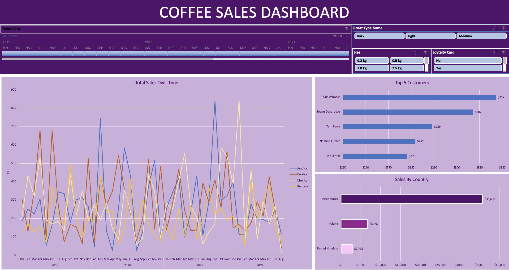

# ☕ Coffee Sales Dashboard (Excel Project)

## 📌 Project Overview

This project is an interactive Excel dashboard that analyzes the sales performance of an online coffee bean retailer. It turns three raw tables (orders, customers, and products) into a single dashboard that shows how sales change over time and where revenue comes from.

The dashboard covers 1,000 order lines from January 2019 to August 2022. Users can track total sales by coffee type, compare sales across countries, and see the top five customers. Slicers and a timeline let users filter every chart at once.

## 🎯 Key Features

✅ Interactive Timeline: Filter all charts by order date (years, quarters, or months). 
✅ Interactive Slicers: Filter by Roast Type (Light, Medium, Dark), Bag Size (0.2 kg to 2.5 kg), and Loyalty Card status. 
✅ Sales Trend Line Chart: Monthly sales over time, split by coffee type (Arabica, Excelsa, Liberica, Robusta). 
✅ Sales by Country: Bar chart comparing the United States, Ireland, and the United Kingdom. 
✅ Top 5 Customers: Bar chart of the highest-spending customers. 
✅ Connected Pivot Tables: Every chart is driven by a pivot table, so one slicer click updates the whole dashboard.

## 📷 Dashboard Preview

## 🗂️ Repository Files

| File | Description |
|------|-------------|
| `coffee_rawdata.xlsx` | Raw dataset: `orders`, `customers`, and `products` sheets before any cleaning or lookups |
| `CoffeeSalesDashboard.xlsx` | Finished workbook: cleaned data, pivot tables, and the interactive dashboard |
| `CoffeeSalesDashboard.png` | Screenshot of the dashboard |

## 🧹 Data Preparation

- Used **XLOOKUP** to pull customer name, email, country, and loyalty card status from the `customers` sheet into the `orders` sheet.
- Used **INDEX / MATCH** to pull coffee type, roast type, size, and unit price from the `products` sheet.
- Calculated **Sales** as Unit Price × Quantity.
- Used nested **IF** formulas to turn short codes into full names (for example, "Ara" to "Arabica" and "M" to "Medium").
- Replaced blank emails (returned as 0) with empty cells.
- Converted the orders range into an **Excel Table** so new rows flow into the pivot tables.

## 🛠️ Skills & Tools Applied

- Excel Functions: XLOOKUP, INDEX / MATCH, IF
- Excel Features: Tables, Pivot Tables, Pivot Charts, Slicers, Timeline
- Data Cleaning: Lookups across sheets, code-to-label mapping, number formatting
- Data Storytelling: Designing a one-page dashboard that answers business questions at a glance

## 📈 Business Questions Answered

This dashboard provides insights into:

- How sales change month to month for each coffee type.
- Which countries bring in the most revenue.
- Who the top five customers are by total spend.
- How roast type, bag size, and loyalty card status affect sales.

## 💡 Key Insights

- Total sales reached **$45,134** across 957 orders and 913 customers.
- The **United States** made up about **79%** of sales. Ireland made up about 15% and the United Kingdom about 6%.
- Sales were spread fairly evenly across coffee types. **Excelsa** led with $12,306, and **Robusta** trailed with $9,005.
- **Light roast** was the top roast type at about 38% of sales.
- **2.5 kg bags** brought in over half of all revenue (about 53%).
- Customers **without** a loyalty card spent slightly more in total than card holders (54% vs. 46%).
- The best month was **February 2020** at about $1,798 in sales.
- **Allis Wilmore** was the top customer at $317.

## 🚀 Learning Outcomes

Building this dashboard strengthened my skills in:

📌 Combining data from several tables with XLOOKUP and INDEX / MATCH 
📌 Building pivot tables and pivot charts that connect to shared slicers and timelines 
📌 Cleaning and labeling raw data so it is ready for analysis 
📌 Designing a clean, single-page dashboard layout

## 🙌 Acknowledgment

This project helped me build a full Excel workflow, from raw data to a finished dashboard. It shows how a few well-chosen charts can help a small business understand its customers and products.

<!-- Optional: if you built this from a tutorial or public dataset, credit it here, for example:
Dataset and project idea based on [Tutorial Name](link). -->

## 🔗 Related Link

[LinkedIn Post](https://www.linkedin.com/feed/update/urn:li:share:7513314426033209344/)

## 🧑‍💻 Author

**Omar Shazley**: Data Analyst | Excel, SQL, and healthcare data analytics

💼 [LinkedIn](https://www.linkedin.com/in/omar-shazley-914a16b1/) 
📧 Email: omarshazley@gmail.com

✨ **If you like this project, don't forget to ⭐ star the repo!**
